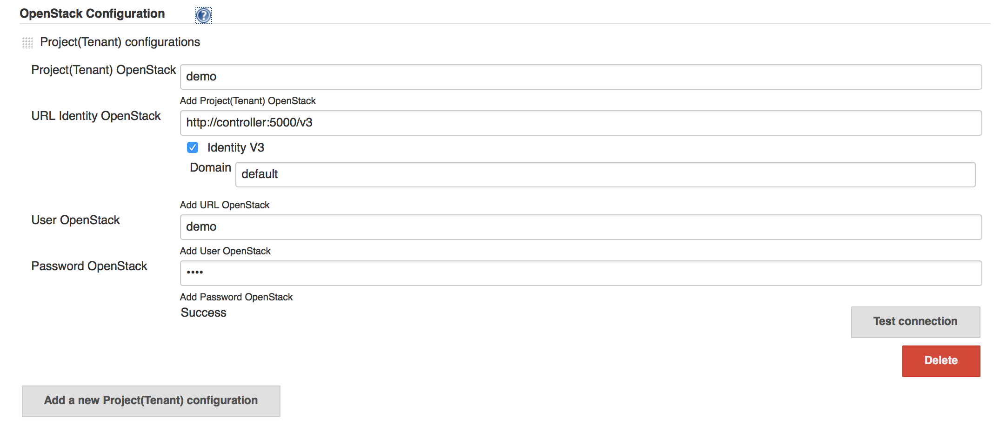
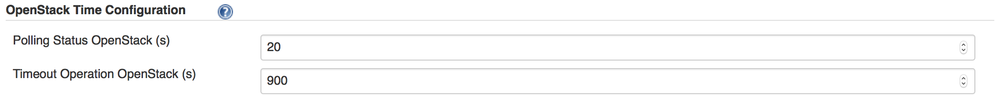
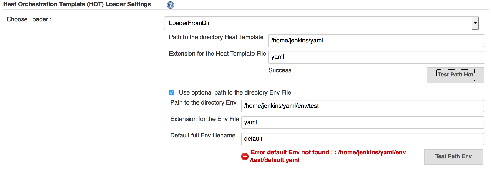
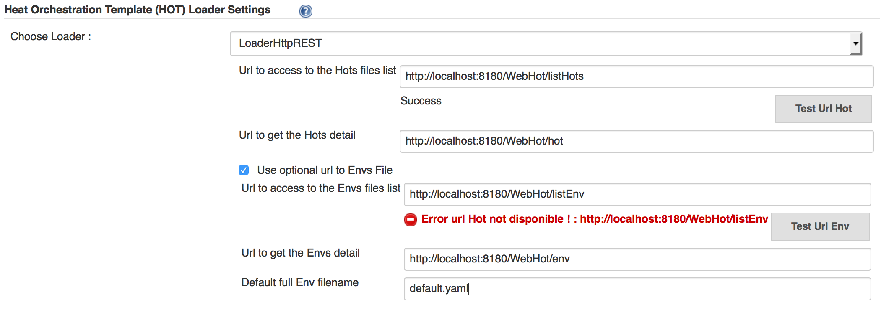
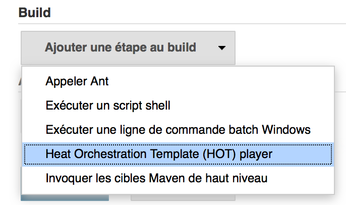
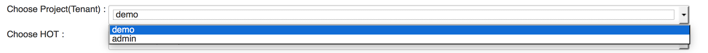
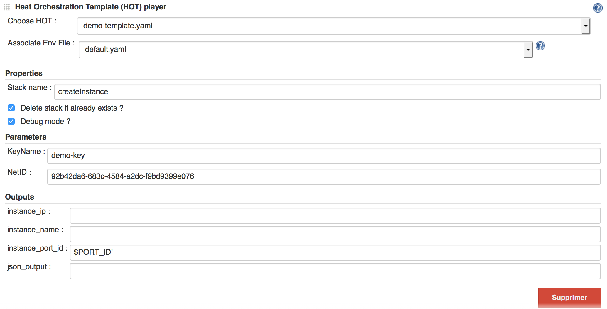
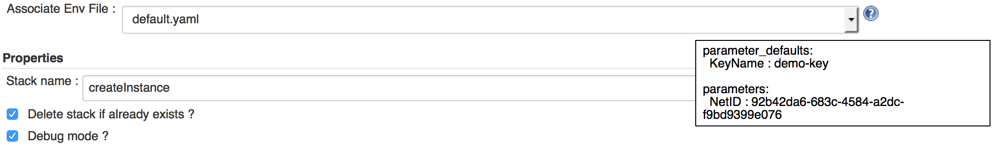
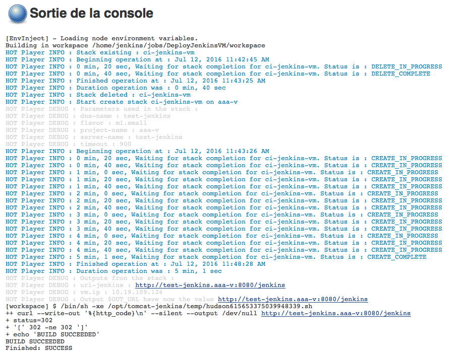

# Openstack Heat Jenkins plugin

## Description
--------------
Openstack Heat is a Jenkins plugin that allows to interact with OpenStack by using the Heat API.<br />
When you configure a project, you can add a step build HOT player. At this time, you can choose a tenant/yaml file/env file from differents lists.<br />
When a selection is done, the plugin generates automatically the interface from the differents parameters (yaml file, env file...) and you can configure the heat interactions. You can create differents HOT player steps and exchange data between them.<br />
When the job is launched, the plugin calls OpenStack via the Heat API with the configuration and the Jenkins console shows the outputs from the interaction.<br />

## Table of Contents
--------------------
* [Installation](#installation)<br/>
* [Usage](#usage)<br/>
	- [Global configuration](#global-configuration)<br/>
	- [Step configuration](#step-configuration)<br/>
	- [Execution](#execution)<br/>
* [Development](#development)<br/>
* [License](#license)<br/>

## Installation
---------------
The plugin can be install with the differents methods described in the Jenkins documentation : [Jenkins Plugins - How to install plugins](https://wiki.jenkins-ci.org/display/JENKINS/Plugins#Plugins-Howtoinstallplugins)

## Usage
--------
### Global configuration
1. OpenStack Configuration<br /><br />
This section permits to add one or more OpenStack platform(s) by the button **Add a new Project(Tenant) configuration**.<br /><br />
You need to fill the fields :<br />
	* _Project(Tenant) OpenStack_ : Project (Tenant) associated with the identification.<br />
	* _URL Identity OpenStack_ : Url to access the identity service.<br />
	* _Identity V3_ : If the identity uses v3, the check box permits to configure the domain.<br />
	* 	_Domain_ : domain used for the identification.<br />
	* _User OpenStack_ : User to identify on the project(tenant).<br />
	* _Password OpenStack_ : password associated.<br /><br />
_Test connection_ : This button permits to test the parameters by creating a connection.<br/>
_Delete_ : This button permits to delete this configuration panel.<br/>
_Add a new Project(Tenant) configuration_ : this button permits to add multiple projects(tenants) to deploy on different OpenStack.<br/>

2. OpenStack Time Configuration<br /><br />
This section permits to configure the differents timeout associated with OpenStack Heat API.<br /><br />
	* _Polling Status OpenStack (s)_ : This input allows to put the interval in seconds in order that the plugin checks the status of a stack in openstack. By default, the time is 20 seconds.<br />
	* _Timeout Operation OpenStack (s)_ : This input allows to put the interval in seconds in order that the operation via Heat falls in timeout. By default, the time is 15 minutes (900 s).<br />
	
3. Heat Orchestration Template (HOT) Loader Settings<br/><br/>
This section allows to choose a loader to consume the HOT data.<br/><br/>
A loader is divided in two distincts parts:<br/>
	* The configuration to load the files yaml to manage stack, this is mandatory.<br/>
	* The configuration to load optional files env to facilitate sending parameters via the client OpenStack to manage the stacks.<br/><br/>
Currently, it exits two defaults loaders.<br/><br/>
	* _LoaderFromDir_:<br />
		- _Path to the directory Heat Template_ : The absolute path (in the same physical machine that hosting Jenkins server) to the repository containing the yaml files.<br/>
		- _Extension for the Heat Template File_ : The extension associated with the yaml files.<br/
		- _Test Path Hot_ : This button permits to test the yaml files configuration.<br />
		- _Use optional path to the directory Env File_ : When you check this box, you can configure the optional files env.<br/>
		- _Path to the directory Env_ : The absolute path (in the same physical machine that hosting Jenkins server) to the repository containing the env files.<br />
		- _Extension for the Env File_ : The extension associated with the env files.<br/>
		- _Default full Env filename_ : You can indicate a file by default. The plugin tries to find an env file with the same name of the hot file else it uses the default or nothing if this field is empty.<br/>
		- _Test Path Env_ : This button permits to test the env files configuration.<br />
<br/><br/>
	* _LoaderHttpREST_:<br/>
		- _Url to access to the Hots files list_: The url to access at the list of the yaml file. The format is an array json. You can find an example (listHots) in the package /openstack.heat/src/test/resources/com/arkea/jenkins/openstack/heat/yaml.<br/>
		- _Test Url Hot_ : This button permits to test the url yaml files configuration.<br />
		- _Url to get the Hots detail_: The url to access at the detail of an yaml file. The name of the desired yaml file is added at this url for the loading.<br/>
		- _Use optional url to Envs File_:When you check this box, you can configure the optional files env.<br/>
		- _Url to access to the Envs files list_: The url to access at the list of the yaml file. The format is an array json. You can find an example (listEnvs) in the package /openstack.heat/src/test/resources/com/arkea/jenkins/openstack/heat/yaml.<br/>
		- _Test Url Env_ : This button permits to test the url env files configuration.<br />
		- _Url to get the Envs detail_: The url to access at the detail of an env file. The name of the desired env file is added at this url for the loading.<br/>
		- _Default full Env filename_: You can indicate a file by default. The plugin tries to find an env file with the same name of the hot file else it uses the default or nothing if this field is empty.<br/>
<br/>	

### Step configuration

If the global configuration is done and all is correct, then in a free-style project you can see the item **Heat Orchestration Template (HOT) player** in the list build step.<br/>
<br/>
<br/>
If you have configured many projects, a selectbox appears to choose which project you want to use. Otherwise, if you have only one project, it's selected by default without selectbox.<br/>
<br/>
<br/>
The Heat Orchestration Template (HOT) player allows to play HOT file to OpenStack.<br/>
The HOT player load the HOT file choose in the selectbox and generate dynamically the inputs.<br/>
If the Associate Env File is configured than the selectbox permits to choose one file env file.<br/>
By default when you choose a HOT file, the selectbox Associate Env File tries to select the same env file name if it exits or the default env file if it is configured.<br/>
The inputs are divided in 3 categories :<br/>

1. Properties:<br/>
	* _Stack name_ : corresponding to the the name used in OpenStack.<br/>
	* _Delete stack if already exists ?_ : if you want reuse the same name for a stack, the plugin destroys the stack if already exits.<br/>
	* _Debug mode ?_ : if it's checked than the console print all the differents values parameters.<br/>
2. Parameters:<br/>
	* This category is generated dynamically from the differents parameters present in the HOT.<br/>
3. Outputs:<br/>
	* This category is generated dynamically from the differents outputs present in the HOT.<br/>
<br/>
You can use variable environment in each input. The variable must be start with "$" without "-".<br/>
<br/>
If you fly over the help's icon from the _Associate Env File_ when an entry is selected, you can watch the content of the file.<br/>
<br/>

### Execution

When the job is launched, you can follow the interactions between Jenkins and Openstack in the console. If you have checked the debug mode, the outputs are more verbose.<br/>
If the job have a problem, the console shows the stacktrace.<br/>
<br/>

## Development
---------------

You need **Java 7** and **Maven 3** (3.3.1 minimum) to develop on your computer.<br/>
The first step consists to extract the source via the command **git clone**.<br/>
If you need to clean the project, you can do that via the command **mvn clean** and by deleting the work directory.<br/>

### Eclipse

If you want import the project under Eclipse, you need to launch **mvn eclipse:eclipse** under a terminal in the project's directory.<br/>
After, you just import the project via the menu _File/Import.../Existing Projects into Workspace_ under Eclipse.

### Launch

On a terminal, you can launch a jenkins to test the plugin via the command : **mvn hpi:run -Djetty.port=8080**. You can choose the port.<br />
<br/>
If you want to debug the plugin, you need to create a debug configuration under Eclipse via the menu _Run/Debug configurations.../Remote Java Application/New_. Select the _openstack.heat_ project.<br />
After jenkins runs, under Eclipse, launch the previous configuration. If you put a breakpoint, you can debug the code under Eclipse.

### Test

The source have some tests. If you want to pass them, it's via the command : **mvn test**.
If you want to launch a specific test, execute the command : **mvn -Dtest=ClassNameTest test** where _ClassNameTest_ equals the single class test.<br/>
<br/>
If you want to debug the test, you need to create a debug configuration under Eclipse via the menu _Run/Debug configurations.../Remote Java Application/New_. Select the _openstack.heat_ project and change the port to 5005.<br />
You need to launch the application via the command : **mvn -Dmaven.surefire.debug test**.<br/>
During the launching, the starter wait a connection to the debug port, so under Eclipse, launch the previous configuration. If you put a breakpoint, you can debug the code under Eclipse.<br/>
<br/>
It is possible to combine the twice, for example : **mvn -Dtest=ClassNameTest -Dmaven.surefire.debug test**<br/>

## License
----------
```
Copyright 2015 Credit Mutuel Arkea

Licensed under the Apache License, Version 2.0 (the "License");
you may not use this file except in compliance with the License.
You may obtain a copy of the License at

    http://www.apache.org/licenses/LICENSE-2.0

Unless required by applicable law or agreed to in writing, software
distributed under the License is distributed on an "AS IS" BASIS,
WITHOUT WARRANTIES OR CONDITIONS OF ANY KIND, either express or implied.
See the License for the specific language governing permissions and 
limitations under the License.
```